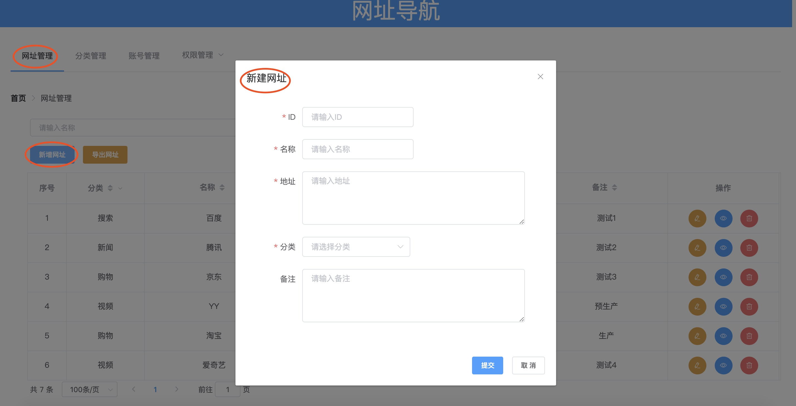

# Navigation

[](https://www.npmjs.com/package/vue-lowdb) [](https://vuejs.org/)

> 导航网址

recommend: [China-Gitee](https://gitee.com/liyinchi/Navigation)，[Other-Github](https://github.com/Musule/Navigation)

## 功能

* 新增分类
* 删除分类
* 编辑分类
* 查询分类
* 新增网址
* 删除网址
* 编辑网址
* 查询网址
* 新建管理员账号、菜单权限
* 编辑管理员账号、菜单权限
* 导出xls

### 【管理员】


### 【访客】


## 开发环境

|名称|版本|
|-|-|
|nodejs|8.11.4|
|vue|2.X|

## 安装

简单命令行即可使用

## Docker安装方式（推荐）

### 1.安装docker

### 2.拉取镜像

（1）前端镜像

```shell
docker pull liyinchi/navigation-frontend
```

（2）后端镜像

```shell
docker pull liyinchi/navigation-server
```

（3）启动容器

```shell
docker run -d --name navigation-frontend -p 3000:80 liyinchi/navigation-frontend
```

```shell
docker run -d --name navigation-server -p 8006:8006 liyinchi/navigation-server
```


（4）访问

后端端口：8006 前端端口：3000

## 普通安装方式

1.下载Nodejs

（建议版本使用v12.13.0 小于v15.0）

>https://npm.taobao.org/mirrors/node/v12.13.0/

>如果已安装配置nodejs，可跳过此步骤

2.安装Nodejs

（1）检查版本
```bash
node -v
```
（2）设置淘宝镜像（提升安装速度）
```bash
npm config set registry http://registry.npm.taobao.org/
```

>如果你已安装Nodejs环境，可跳过1和2步骤

## 使用


### 直接使用

#### 1.启动后端服务

（1） 打开终端窗口，进入目录/Navigation/server下

```bash
cd /Navigation/server
```
（2） 执行安装

```bash
npm install
```

（3） 命令行切换到server文件夹下
```bash
cd server
```

（3） 启动后端服务
```bash
node server
```


#### 2.打开前端页面

打开目录下/dist/index.html直接使用，或者将dist放入tomcat的webapp中实现web服务器让其他小伙伴也能通过ip地


### 二次开发

#### 1.启动后端服务

同上

#### 2.启动前端页面

（1）前端

打开新的终端窗口，进入目录/Navigation下，执行命令行如下命令：

```bash
cd /Navigation
```

（2）安装

* 安装cnpm
```
npm install -g cnpm --registry=https://registry.npm.taobao.org
```

* 安装node-sass

```bash
cnpm install node-sass --save
```

```
npm install node-sass --save-dev

```

* 安装其他依赖
```bash
npm install
```

（3）启动开发者模式

```bash
npm run dev
```


（3）浏览器地址访问
>http://localhost:8088


（4）window平台报错：“Module build failed: Error: Cannot find module 'node-sass’解决”

解决办法：

在win10 系统中搜索框 输入 Windos PowerShell

选择 管理员身份运行

打开了powershell命令行之后,输入

set-ExecutionPolicy RemoteSigned

更改权限为A

输入get-ExecutionPolicy

如下图所示：


>参考：https://www.cnblogs.com/mfbzr/p/12274950.html


# 操作手册

## 登录管理员

账号：admin
密码：123456


>访客无需登录，仅有查看权限

## 新增网页




## 新增分类


## 筛选分类


## 新增账号


## 导出数据


# 修复记录

* 2020-07-12 修复node-sass版本4.11.0因版本过低导致的报错
* 2020-08-21 修复nodejs版本兼容v12.13.0
